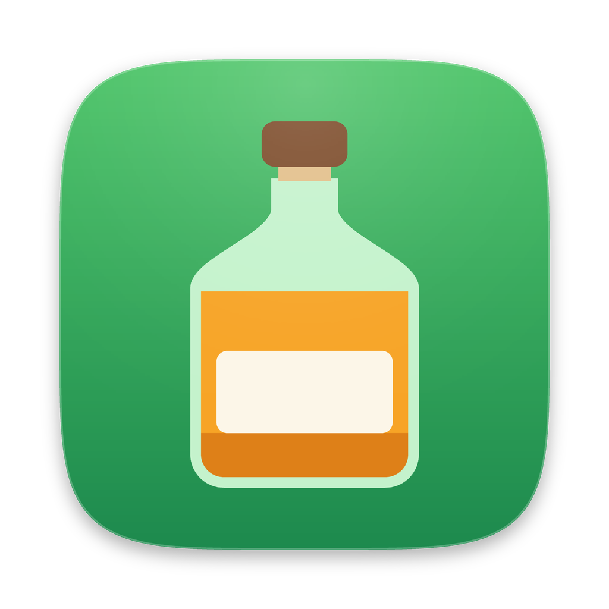
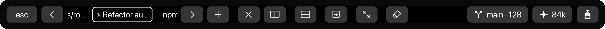
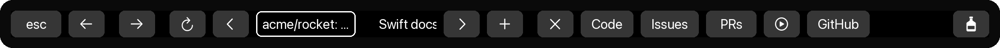
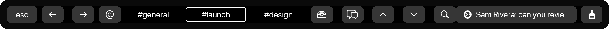

<p align="center">
  
</p>

<h1 align="center">BarMaster</h1>

<p align="center">
  A Touch Bar that actually does something, for Chrome, Slack and Ghostty.<br />
  Native Swift, event-driven and close to zero CPU while idle.
</p>

---

BarMaster is a small menu-bar app for MacBooks with a Touch Bar. When Chrome,
Slack or Ghostty is in front, the Touch Bar becomes a set of controls for that
app: a tab strip you can tap, buttons for the site you're on, a Slack channel
switcher, live Slack mentions, and the git branch and Claude Code usage of the
terminal you're working in. Switch to any other app and its own Touch Bar comes
back.

<p align="center">
  <br />
  <sub><b>Ghostty</b>: tab strip, splits, git branch with commit count, Claude Code context</sub>
</p>
<p align="center">
  <br />
  <sub><b>Chrome</b> on a GitHub repo: tabs plus that repo's Code, Issues, PRs and Actions</sub>
</p>
<p align="center">
  <br />
  <sub><b>Slack</b>: channel switcher, shortcuts and a live mention</sub>
</p>

<p align="center"><sub>Illustrations drawn by <code>Scripts/make_screenshots.py</code> with made-up tabs and channels.</sub></p>

## Features

### Ghostty
- **Tab strip** showing every tab, highlighting the selected one. It follows
  you when you switch tabs with the keyboard or mouse.
- Previous / next / new / close tab, split right / down, next split, zoom,
  clear. These are Ghostty's own actions, so they behave exactly like its
  shortcuts.
- **Git status**: `branch · commit count` for the folder the focused terminal
  is in. It updates by itself after a commit or checkout.
- **Claude Code context**: the current session's token count, shown only in
  tabs that are running Claude Code.

### Chrome
- Tab strip, back / forward / reload, new / close / reopen tab.
- **Your own buttons per website**, set in a JSON file. Buttons can run
  JavaScript in the page, open a URL, press a shortcut or run a shell command.
  It ships with GitHub buttons for your repos, pull requests, issues and the
  current repo's Code / Issues / PRs / Actions.

### Slack
- **Live mentions on every bar.** When someone @mentions or DMs you, it shows
  on the Touch Bar in any app. Tap it to open the message.
- **Channel switcher**: your favourite channels, then the ones you were
  recently mentioned in.
- Unreads, threads, previous / next unread channel, jump to, back / forward.
- **Client-only**: no Slack app, no tokens, nothing installed in your
  workspace.

### Everywhere
- **Esc** on every bar, since Touch Bar MacBooks have no physical Esc key.
- **Dialogs get through.** When an app asks something like "Close this tab?",
  BarMaster steps aside so you can tap the dialog's buttons, then comes back.
- A bottle button hands the Touch Bar back to the app; the bottle in the
  Control Strip brings BarMaster back.
- Menu bar: **Enabled** (turn BarMaster off completely), **Open at Login**,
  **Edit Chrome Buttons…**, **Edit Slack Channels…**.

## Install

Requires a MacBook with a Touch Bar, macOS 13 or later, and the Xcode Command
Line Tools (`xcode-select --install`). Xcode itself isn't needed.

```sh
git clone https://github.com/l1203012/BarMaster.git
cd BarMaster
Scripts/make-dev-cert.sh      # once: a local signing identity, so permissions survive rebuilds
Scripts/build.sh install      # builds into /Applications and opens it
```

On first launch, macOS asks for two permissions:

- **Accessibility** (System Settings → Privacy & Security → Accessibility).
  BarMaster needs it to press keys like Esc and the Slack shortcuts, to follow
  tab switches and dialogs, and to see Slack's notifications.
- **Automation** for Chrome and Ghostty, asked the first time you tap one of
  their buttons. BarMaster needs it to read and switch tabs.

Ghostty needs version 1.3 or later (for its AppleScript support).

## Configuration

### Chrome buttons

Menu bar bottle → **Edit Chrome Buttons…** opens
`~/Library/Application Support/BarMaster/Chrome.json`. Changes apply as soon as
you save.

```json
{
  "domains": {
    "*": [
      { "title": "GitHub", "url": "https://github.com/YOUR_USERNAME?tab=repositories" }
    ],
    "github.com": [
      { "title": "PRs", "url": "https://github.com/pulls" },
      { "title": "Issues", "url": "https://github.com/issues" }
    ],
    "github.com/*/*": [
      { "title": "Issues", "url": "https://github.com/{1}/{2}/issues" },
      { "symbol": "play.circle", "url": "https://github.com/{1}/{2}/actions" }
    ],
    "youtube.com": [
      { "symbol": "playpause.fill", "keys": "k" },
      { "title": "2×", "js": "document.querySelector('video').playbackRate = 2" }
    ]
  }
}
```

- **Matching:**
  - A key is a domain, optionally followed by a path pattern in which `*`
    matches one segment.
  - The most specific matching key wins, so `github.com/*/*` (a repo page)
    beats `github.com`.
  - Domains cover their subdomains, and `www.` is ignored.
  - `"*"` buttons are added on every site.
- **Labels:** each button has a `title`, an SF Symbol `symbol`, or both.
- **Actions:** each button has exactly one:

  | Action | What it does |
  |---|---|
  | `url` | Opens in the current tab. `{url}` and `{host}` are the current page's, and `{1}`, `{2}`… are its path segments. |
  | `js` | Runs in the page. Needs Chrome → View → Developer → **Allow JavaScript from Apple Events**. |
  | `keys` | Presses a shortcut such as `cmd+shift+c`, `k` or `alt+left`. |
  | `shell` | Runs through your login shell with `$BARMASTER_URL`, `$BARMASTER_HOST` and `$BARMASTER_TITLE` set. |

- **Mistakes:** if the file has an error, a **⚠ Chrome.json** button appears.
  Tap it to open the file.

### Slack channels

Menu bar bottle → **Edit Slack Channels…** opens `Slack.json`:

```json
{ "channels": ["#general", "#dev", "Sam Example"] }
```

Tapping a channel or person jumps there through Slack's ⌘K switcher.

**How mentions work:**
- They come from Slack's own notifications, so keep those on. Mentions and
  DMs is Slack's default.
- Tapping a mention while its banner is still on screen opens the exact
  message. After that, it opens the conversation.
- Mentions clear once Slack's Dock badge does.

## How it works

- **Taking over the Touch Bar:** the public Touch Bar API only works while your
  own app is in front. Like BetterTouchTool, MTMR and Pock, BarMaster uses the
  private `DFRFoundation` framework to show its bar over other apps. Those calls
  are resolved at runtime in one file (`SystemTouchBar.swift`). This is also why
  it can't be on the Mac App Store.
- **Nothing polls.** BarMaster has no timers. It reacts only to:
  - app switches (`NSWorkspace` notifications);
  - window, title and dialog changes (Accessibility observers);
  - file changes (kqueue watches on the git reflog, the Claude Code transcript
    and the config files).
- **Talking to apps:**
  - Chrome and Ghostty through AppleScript, on a background queue.
  - Slack through its keyboard shortcuts and its notification banners.
- **Footprint:** about 30 MB of memory and 0% CPU while idle, measured on a
  2017 MacBook Pro.

The design notes and decisions are in [Docs/PLAN.md](Docs/PLAN.md).

## Privacy

- Everything stays on your Mac. BarMaster makes no network requests.
- It reads Slack's notification banners only to show your mentions, and it
  ignores other apps' notifications.
- Claude Code usage is read from the transcript files Claude Code already
  writes in `~/.claude/projects`.

## Development

```sh
Scripts/build.sh               # compile
Scripts/build.sh run           # build .build/BarMaster.app, restart it
Scripts/build.sh install       # optimised build into /Applications
python3 Scripts/make_logo.py   # regenerate the icon (needs Pillow)
python3 Scripts/make_screenshots.py   # redraw the README's Touch Bar images (needs Pillow)
```

The build uses plain `swiftc`, so the Command Line Tools are enough.
`Package.swift` mirrors the same targets for SwiftPM and editors.

## License

[MIT](LICENSE)
